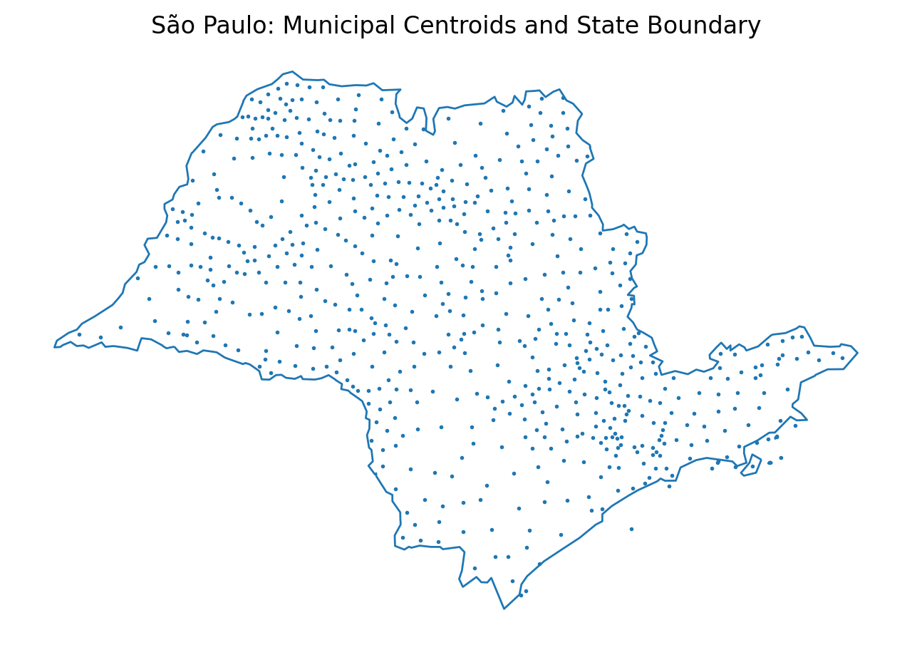
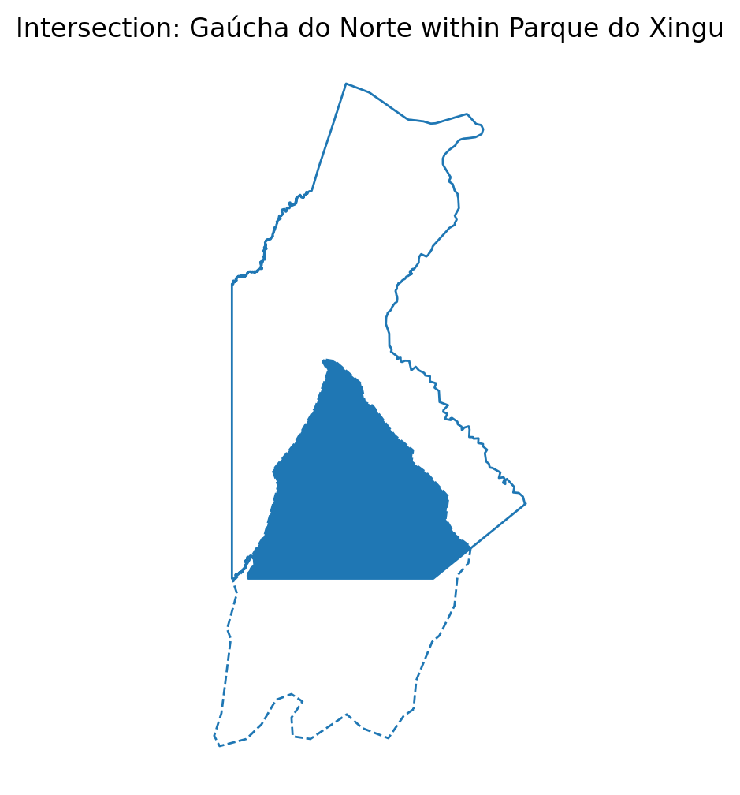
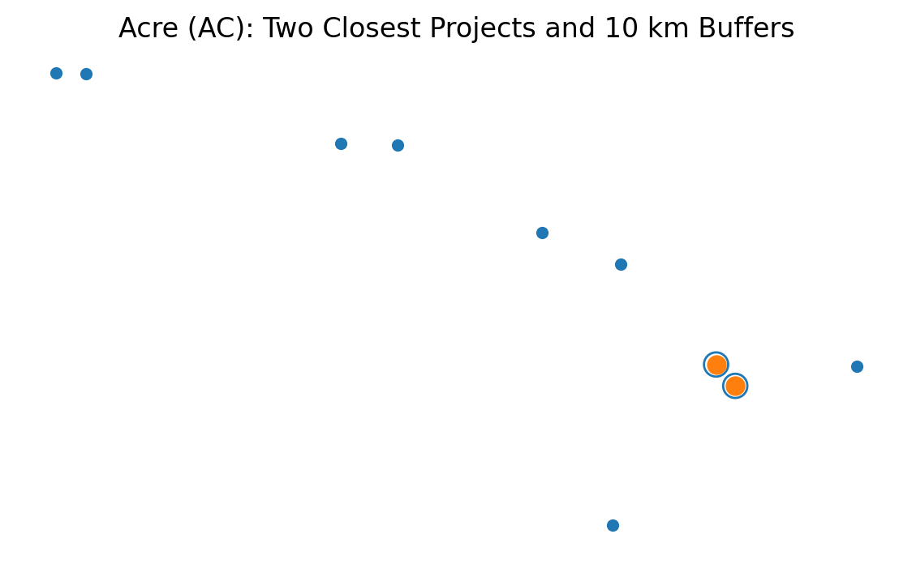
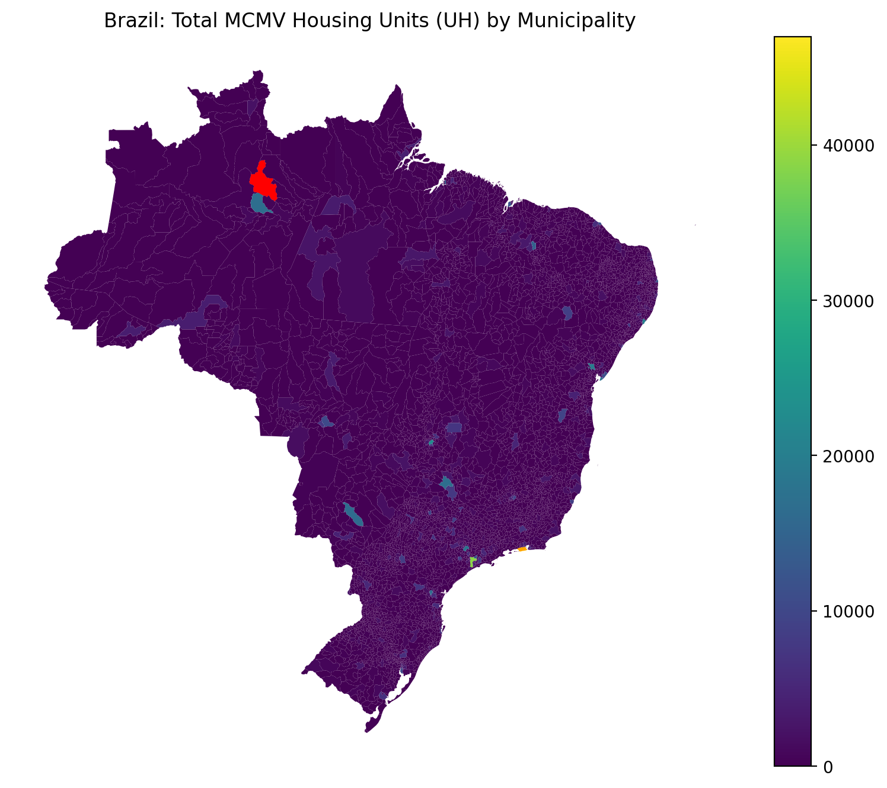

# QGIS Spatial Analysis Practical – Brazil Case Study

## 📌 Overview

This project demonstrates applied **Geographic Information Systems (GIS)** workflows using QGIS to perform spatial analysis on Brazilian municipal, indigenous territory, and housing datasets.

The practical integrates vector processing, overlay modelling, proximity analysis, buffering, statistical aggregation, and cartographic visualisation.

## 🧠 Analytical Tasks

1. Generate centroids and dissolve boundaries (São Paulo)
2. Compute mean HDI by state
3. Perform polygon intersection (Gaúcha do Norte × Parque do Xingu)
4. Identify nearest housing projects in Acre + 10km buffers
5. Aggregate housing units (UH) by municipality

---

## 🗺️ Map Outputs

### São Paulo Centroids & Boundary

### Intersection Analysis

### Proximity + Buffers (Acre)

### Housing Unit Aggregation (Brazil)

---

## 🛠 Tools Used

- QGIS (latest version)
- Vector geometry tools
- Overlay analysis
- Distance matrix
- Buffer modelling
- Spatial join (summary)

---

## 📊 Skills Demonstrated

✔ Spatial reasoning  
✔ Vector data modelling  
✔ Proximity analysis  
✔ Spatial aggregation  
✔ Cartographic communication  
✔ CRS awareness for measurement accuracy  

---
## 🚀 Author

Diana Nakiwala  
MSc Data Science – University of East London

